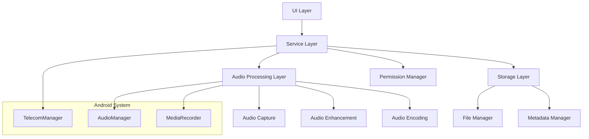

# Design Document

## Overview

Pixel 7 Pro用ネイティブ通話録音アプリケーションの設計書です。Android 10以降の制約を考慮し、Pixel 7 ProのTensor G2チップの音声処理能力を活用して、高品質な通話録音機能を提供します。

## Architecture

### システム構成



### 主要コンポーネント

1. **CallRecordingService**: バックグラウンドで動作する録音サービス
2. **AudioProcessor**: 音声の取得、処理、エンコーディングを担当
3. **FileManager**: 録音ファイルの保存と管理
4. **PermissionManager**: 必要な権限の管理
5. **MainActivity**: メインUI画面
6. **RecordingListActivity**: 録音ファイル一覧画面

## Components and Interfaces

### CallRecordingService

```kotlin
interface CallRecordingService {
    fun startRecording(callId: String): Boolean
    fun stopRecording(): RecordingResult
    fun isRecording(): Boolean
    fun getRecordingStatus(): RecordingStatus
}
```

**責任:**
- 通話状態の監視
- 録音の開始/停止制御
- フォアグラウンドサービスとしての動作

### AudioProcessor

```kotlin
interface AudioProcessor {
    fun initializeAudioCapture(): Boolean
    fun startCapture(outputFile: File): Boolean
    fun stopCapture(): AudioProcessingResult
    fun applyAudioEnhancement(inputFile: File, outputFile: File): Boolean
    fun normalizeAudio(file: File): Boolean
}
```

**責任:**
- 音声キャプチャの初期化
- リアルタイム音声処理
- 音声レベルの最適化
- ファイルエンコーディング

### FileManager

```kotlin
interface FileManager {
    fun createRecordingFile(callInfo: CallInfo): File
    fun saveRecording(file: File, metadata: RecordingMetadata): Boolean
    fun getAllRecordings(): List<Recording>
    fun deleteRecording(recordingId: String): Boolean
    fun getRecordingPath(recordingId: String): String?
}
```

## Data Models

### Recording

```kotlin
data class Recording(
    val id: String,
    val fileName: String,
    val filePath: String,
    val contactName: String?,
    val phoneNumber: String,
    val duration: Long,
    val fileSize: Long,
    val recordingDate: LocalDateTime,
    val audioQuality: AudioQuality,
    val isIncoming: Boolean
)
```

### CallInfo

```kotlin
data class CallInfo(
    val callId: String,
    val phoneNumber: String,
    val contactName: String?,
    val isIncoming: Boolean,
    val startTime: LocalDateTime
)
```

### AudioQuality

```kotlin
enum class AudioQuality(
    val sampleRate: Int,
    val bitRate: Int,
    val channels: Int
) {
    HIGH_QUALITY(48000, 128000, 2),
    STANDARD(44100, 64000, 1),
    SPACE_SAVING(22050, 32000, 1)
}
```

## Error Handling

### 権限エラー

```kotlin
sealed class PermissionError : Exception() {
    object MicrophonePermissionDenied : PermissionError()
    object PhoneStatePermissionDenied : PermissionError()
    object StoragePermissionDenied : PermissionError()
}
```

### 録音エラー

```kotlin
sealed class RecordingError : Exception() {
    object AudioSourceNotAvailable : RecordingError()
    object InsufficientStorage : RecordingError()
    object AudioProcessingFailed : RecordingError()
    object FileCreationFailed : RecordingError()
}
```

### エラーハンドリング戦略

1. **権限エラー**: ユーザーに分かりやすいメッセージで権限要求
2. **録音エラー**: 代替手段の提案とエラーログの記録
3. **ストレージエラー**: 容量不足の警告と古いファイルの削除提案
4. **ネットワークエラー**: オフライン機能の提供

## Testing Strategy

### Unit Tests

1. **AudioProcessor Tests**
   - 音声キャプチャの初期化テスト
   - 音声処理アルゴリズムのテスト
   - ファイルエンコーディングのテスト

2. **FileManager Tests**
   - ファイル作成/削除のテスト
   - メタデータ保存のテスト
   - ストレージ容量チェックのテスト

3. **PermissionManager Tests**
   - 権限状態チェックのテスト
   - 権限要求フローのテスト

### Integration Tests

1. **CallRecordingService Tests**
   - 通話検出から録音開始までのフローテスト
   - バックグラウンド動作のテスト
   - サービス再起動時の状態復元テスト

2. **End-to-End Tests**
   - 完全な録音フローのテスト
   - UI操作から録音完了までのテスト
   - ファイル再生機能のテスト

### Performance Tests

1. **Audio Processing Performance**
   - リアルタイム音声処理の遅延測定
   - CPU使用率の監視
   - バッテリー消費量の測定

2. **Storage Performance**
   - 大量ファイル処理のパフォーマンステスト
   - ファイル検索速度のテスト

## 技術的実装詳細

### Pixel 7 Pro最適化

1. **Tensor G2チップ活用**
   - ハードウェアアクセラレーション対応の音声処理
   - 機械学習ベースのノイズリダクション
   - リアルタイム音声強化

2. **Android 13対応**
   - 新しいプライバシー機能への対応
   - 通知権限の適切な処理
   - バックグラウンド制限への対応

### 音声品質向上戦略

1. **マルチソース録音**
   - マイクとスピーカーの両方から音声取得
   - 音声ミキシングによる品質向上

2. **リアルタイム処理**
   - 自動ゲイン制御（AGC）
   - ノイズサプレッション
   - エコーキャンセレーション

3. **ポスト処理**
   - 音声正規化
   - 動的レンジ圧縮
   - 周波数特性の最適化