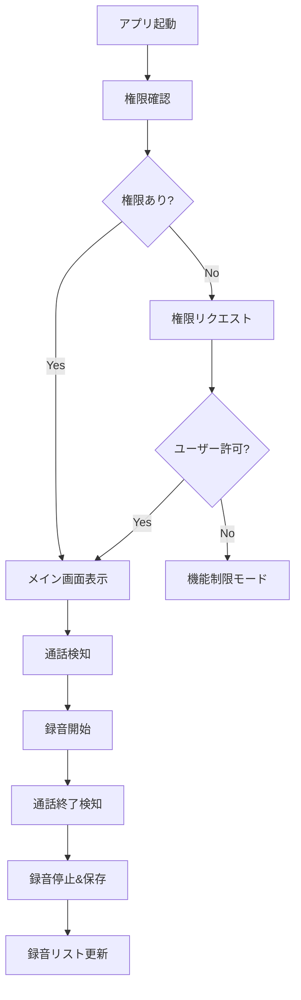

# Pixel Call Recorder 設計書

## 1. アーキテクチャ概要


## 2. プロジェクト構造
```
/pixel-call-recorder
├── /app
│   ├── /src/main
│   │   ├── /java/com/example/pixelcallrecorder
│   │   │   ├── di (Dependency Injection)
│   │   │   ├── ui (Activity/Fragment)
│   │   │   ├── viewmodel (ViewModel)
│   │   │   ├── repository (Data層)
│   │   │   ├── service (バックグラウンドサービス)
│   │   │   └── utils (共通ユーティリティ)
│   │   └── /res
│   │       ├── /layout
│   │       ├── /values
│   │       └── /raw (同意文書等)
├── /build.gradle (プロジェクト全体設定)
└── /app/build.gradle (モジュール設定)
```

## 3. 技術スタック
- **言語**: Kotlin 100%
- **アーキテクチャ**: MVVM + Clean Architecture
- **主要ライブラリ**:
  - AndroidX (ViewModel, LiveData)
  - Hilt (Dependency Injection)
  - Room (ローカルデータベース)
  - WorkManager (バックグラウンド処理)

## 4. 主要コンポーネント
| コンポーネント | 責任 |
|---------------|------|
| `CallRecorderService` | 通話状態監視と録音管理 |
| `PermissionManager` | 権限リクエストと状態管理 |
| `ConsentManager` | ユーザー同意の取得と管理 |
| `AudioRecorder` | 実際の録音処理実装 |

## 5. プロトタイプ実装計画
1. 基本プロジェクト設定 (Gradle, 依存関係)
2. 権限管理モジュールの実装
3. 通話検知サービスのプロトタイプ
4. 簡易録音機能の実装
5. 同意取得フローの実装
